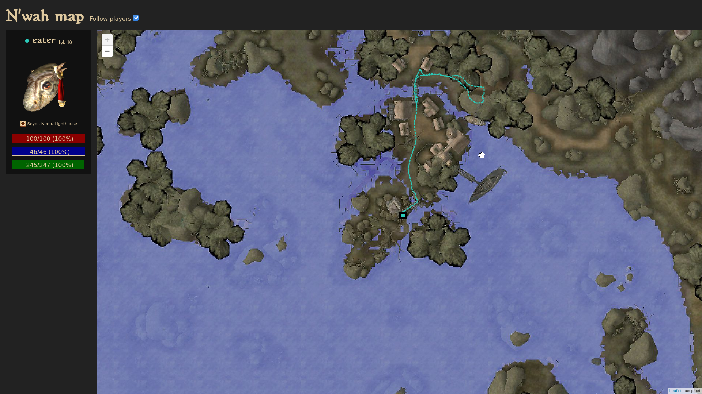

# nwahmap
You N'wah really need a map to get around?



---

Nwahmap is a companion site for NwaHTTP the tes3mp plugin 

## Setup

Please make sure [`git-lfs`](https://git-lfs.github.com/) is installed. this is used to store the tiles.

```bash
git clone git@git.cijber.net:teamnwah/nwahmap.git nwahmap
cd $_
# Extract tiles from storage/mwmap-tiles.txz
bin/extract-tiles.sh
# Extract 3d files and textures head renders (Optional)
script/export_nif.py <morrowind>/Data\ Files/Meshes/b <morrowind>/Data\ Files/Textures public/blob
# Install dependencies
yarn
webpack
```

Then place the files under `public` at `$TES3MP_HOME/www` and nwahttp will serve them for you if installed

---

Code licensed under AGPL-3.0-or-later
Tiles for morrowind licensed under cc-by-sa, source: <a href="https://mwmap.uesp.net/">uesp.net</a>

Dependencies may be licensed seperately.
